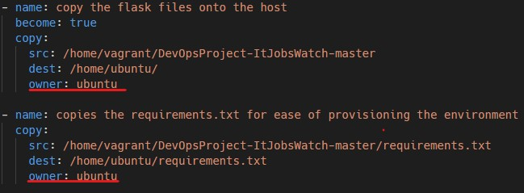
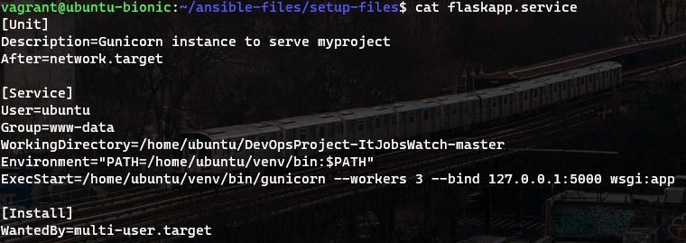

# Web scraping app using Python

- A full project that will create a development, testing and deployment environment for the app found in `DevOpsProject-ItJobsWatch-master`

- The main folders:
    1. `ansible-files` contains Ansible playbooks for the creating of VPCs and EC2 instances as well as for the provisioning of EC2 instances to run the app
    2. `vagrant-setup` contains the provision file for the Vagrant machine
    3. `DevOpsProject-ItJobsWatch-master` contains the main web scraper as well as the Flask app and HTML files used to create a front-end

 

## Pre-requisites
- You will need the following available on your machine:
    - `Git`
    - `Vagrant`

 

## Contents
0. [Overview](https://github.com/jaredsparta/Scraper-Project#Overview) 
1. [Creating a development environment](https://github.com/jaredsparta/Scraper-Project#Dev-Environments)
2. [CI/CD](https://github.com/jaredsparta/Scraper-Project#CICD-or-Continuous-Integration-and-Deployment)
3. [Ansible](https://github.com/jaredsparta/Scraper-Project#Ansible-to-create-the-Deployment-environment)
4. [Flask app](https://github.com/jaredsparta/Scraper-Project#Getting-the-Flask-app-running)

 

## Overview

- The Vagrant machine will be the development environment and act as the Ansible controller

- The Ansible playbooks will be used to create the initial infrastructure:
    1. Prepare the access and secret keys for AWS as mentioned in section 3
    2. Run `ansible-files/creating-infrastructure/create-vpc.yml` to create the VPC and subnet
    3. Collect the VPC and subnet ID and input these values into the variables in `ansible-files/creating-infrastructure/ec2-deployment-env.yml` as well as configuring it to your own circumstances and then run it to create an EC2 instance
    4. Collect the instance ID and input it into `ansible-files\setup-files\hosts` 
    5. Find a way to bring your AWS instance key and put the file into `/home/vagrant/.ssh/` and put this path into the hosts
    6. Lastly, configure `ansible-files\host-playbooks\scraper-host.yml` and run it to deploy the app

- Create the Jenkins CI/CD pipeline once the instance has been created

 

## Dev Environments
- We want a development environment that can be used as an Ansible controller and a way to test code in:
    - The `Vagrantfile` present can be used for such a task. It is configured in such a way so that the Ansible playbooks and the app are present on it. This way, one can edit the files on a text editor on their machine and test it manually inside the Ubuntu VM
    - It is advised to use a Python virtual environment to keep the package dependencies consistent throughout environments. One can create a virtual environment using the Python package `venv` with `python3 -m venv <name-of-venv>`
    - To install the necessary Python packages within the virtual environment, you can simply run `python3 -m pip install -r requirements.txt`

- All the necessary provisioning is achieved using `vagrant-setup/provision-ansible.sh` which runs when you `vagrant up` using the Vagrantfile given
    - If you want to change the dependencies, do change the provision file as you see fit

- In some cases, the provision file may fail to install the necessary dependencies for Ansible so you will have to run the command `python -m pip install -r ~/ansible-files/setup-files/requirements.txt` within the VM

 

[Back to top](https://github.com/jaredsparta/Scraper-Project#Contents)

## CI/CD or Continuous Integration and Deployment

- We will make use of Jenkins to automate the building, testing and deploying of pushed code into an EC2 instance.

- To ensure that the Python environment is standardised throughout, we will make use of a virtual environment created through the Python package `venv`
    - Within this environment, we can install all the necessary dependencies of the app through `python3 -m pip install -r setup-files/requirements.txt`
    - The testing of the code will be done in a `venv` as it allows the tests to run with the minimum number of dependencies and will avoid any conflicting packages that might cause an error

 

**What the pipeline does**
- There are two branches in the repository: the master branch and a development branch. This would mirror a real production environment where different developers will be working on different branches.

- When new changes are pushed from the development branch, there will be a trigger to a Jenkins job that will build and test the code. If it passes, the pushed code will be merged with master and pushed to GitHub. The final job will deploy the code onto an EC2 instance that will be running already

 

[Back to top](https://github.com/jaredsparta/Scraper-Project#Contents)

## Ansible to create the Deployment environment
- Things to note:
    1. Ansible will use Python2 by default, you will need to download the necessary Python dependencies for modules to run using `python -m pip install` as opposed to `python3 -m pip install`
    2. If you are intent on Ansible using Python3 then an easy way to do so is explicitly calling it when you run a playbook. For example, `ansible-playbook example-playbook.yml -e 'ansible_python_interpreter=/usr/bin/python3'` will use Python3 as the interpreter
        - If doing so, ensure that you have correctly installed the necessary dependencies

- We will make use of Ansible playbooks and run them on the vagrant machine as the controller

- The AWS access and secret keys is sensitive information and will need to be secured properly. We can make use of Ansible vaults for such a task. The vault (which is really a password-protected YAML file) should be kept in `ansible-playbooks/group_vars/all/`
    1. Create a vault using `ansible-vault create ~/ansible-files/creating-infrastructure/group_vars/all/<name-of-vault>.yml`
        - I will name mine `aws_keys.yml`
        - Choose the password as you see fit
    2. Input the access and secret keys inside this file as well as your public IP address (for use in playbooks). It should look like the following

    
    
    3. To see what's inside the file after exiting you can `ansible-vault view aws_keys.yml`
    4. To edit the keys again you can `ansible-vault edit aws_keys.yml`

- Finally, to run playbooks with the use of ansible vaults, you can run `ansible-playbook <playbook-name>.yml --ask-vault-pass`

 

**Creating the VPC**

- In an effort to programmatically create infrastructure, we will make use of Ansible playbooks to create a VPC in which we will create an EC2 instance to deploy the app

- The following Ansible modules were used to write `create-vpc.yml`:
    1. `ec2_vpc_net`
    2. `community.aws.ec2_vpc_nacl`
    3. `community.aws.ec2_vpc_igw`
    4. `amazon.aws.ec2_vpc_subnet`
    5. `community.aws.ec2_vpc_route_table`

 

**Creating the deployment environment EC2 instance**

- Again, a more efficient method to creating instances is through Ansible. We will make use of playbooks to create EC2 instances within the newly-created VPC.

- The following Ansible modules were used to write `ec2-deployment-env.yml`:
    1. `community.aws.ec2_instance`
    2. `amazon.aws.ec2_group`

 

**Creating the playbook that would prepare the environment to run the app**

- Notes to be made:
    1. There was some issues with `scp` when copying in files via a Jenkins job, mainly that there were permissions error (i.e. the user that Jenkins SSH'ed into had no permission to change them). This was fixed by adding a line in the playbook that explicitly states the owner of the files to be copied as `ubuntu` -- the user Jenkins SSH's into the instance as

    

- I wrote this playbook to give me a way to deploy the app on a newly-created EC2 instance. It makes use of the following Ansible modules:
    1. `file`
    2. `apt`
    3. `copy`
    4. `service`
    5. `shell`
    6. `pip`
    7. `systemd`

- The playbook will: install the necessary packages; install the pip dependencies; create a virtal environment for the app to run; create a new system service for the app; reconfigure nginx as a reverse-proxy; and finally start the app

 

[Back to top](https://github.com/jaredsparta/Scraper-Project#Contents)

## Getting the Flask app running
- The main steps I took to ensure that the Flask app was implemented properly in a production environment were to do the following:
    1. Use nginx as a reverse-proxy to port 5000 (where my Flask app was running)
    2. Use `gunicorn` as the server for Flask to run on
    3. Created a system service that would allow me to restart the Flask app, similar to how nginx is restarted etc.

- The system service was created in `/etc/systemd/system/` and had the following information:

 

**Writing the actual Flask code**

- Very little refactoring of code was done. For the ones that were refactored, nothing was removed but some functions were just added:
    1. Created another python file that did the exact same thing as the app but without user input (so all it would do is insert a `.csv` file into the `~/Downloads` folder)
    2. When it downloaded, I wrote a function that would read in the `.csv` and parse the information into a dictionary which I could parse again into an HTML file using Jinja2 syntax (exactly like variable substituting in Ansible playbooks)
    3. Then the rest of the front-end was simply Flask syntax, do read the comments written in `app.py` for more

- The main files that the Flask app uses are found in `DevOpsProject-ItJobsWatch-master`:
    1. `app.py` is the actual Flask app itself
    2. `templates/` are where the HTML files that Flask uses are kept
    3. `static/` contains all the images used in these HTML files
    4. `wsgi.py` is a Python script that imports the Flask app -- this was used to actually make the system service as shown above (this was preferable as changing the app meant I wouldn't have to reload the actual service file itself since `wsgi.py` remained unchanged)

 

[Back to top](https://github.com/jaredsparta/Scraper-Project#Contents)

---
**Used:**
- [Creating system services](https://www.digitalocean.com/community/tutorials/how-to-serve-flask-applications-with-gunicorn-and-nginx-on-ubuntu-18-04)