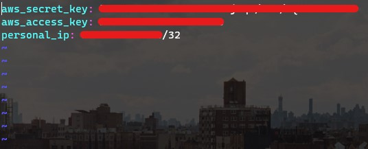

# Web scraping app using Python

- A full project that will create a development, testing and deployment environment for the app found in `DevOpsProject-ItJobsWatch-master`

- All the required infrastructure is created through Ansible playbooks

 

## Pre-requisites
- You will need the following software available on your machine:
    - `Git`
    - `Vagrant`

## Contents
1. [Creating a development environment](https://github.com/jaredsparta/Scraper-Project#Dev-Environments)
2. [CI/CD](https://github.com/jaredsparta/Scraper-Project#CI/CD-or-Continuous-Integration-and-Deployment)
3. [Ansible](https://github.com/jaredsparta/Scraper-Project#Ansible-to-create-the-Deployment-environment)

 

## Dev Environments
- We want a development environment that can be used both as an Ansible controller and 
    - Within `setup-files` there is a `Vagrantfile` that can be used to create a provisioned Ubuntu VM
    - It is advised to use a Python virtual environment and you can create one using the Python package `venv` with `python3 -m venv <name-of-venv>`
    - To install the necessary Python packages within the virtual environment, you can simply run `python3 -m pip install -r requirements.txt`

- All the necessary provisioning is achieved using `setup-files/provision-ansible.sh` which runs when you `vagrant up` using the Vagrantfile given
    - If you want to install more dependencies, please do append this provision file how you see fit

 

[Back to top](https://github.com/jaredsparta/Scraper-Project#Contents)

## CI/CD or Continuous Integration and Deployment

- We will make use of Jenkins to automate the building, testing and deploying of pushed code into an EC2 instance.

- To ensure that the Python environment is standardised throughout, we will make use of a virtual environment created through the Python package `venv`
    - Within this environment, we can install all the necessary dependencies through `python3 -m pip install -r setup-files/requirements.txt`
    - This will allow the tests to run with the minimum number of dependencies and will avoid any packages that might ruin it

 

[Back to top](https://github.com/jaredsparta/Scraper-Project#Contents)

## Ansible to create the Deployment environment
- Things to note:
    1. Ansible will use Python2 by default, you will need to download the necessary Python dependencies for modules to run using `python -m pip install` as opposed to `python3 -m pip install`
    2. If you are intent on Ansible using Python3 then an easy way to do so is explicitly calling it when you run a playbook. For example, `ansible-playbook example-playbook.yml -e 'ansible_python_interpreter=/usr/bin/python3'` will use Python3 as the interpreter
        - If doing so, ensure that you have correctly installed the necessary dependencies

- We will make use of Ansible playbooks and run them on the vagrant machine as the controller

- The AWS access and secret keys is sensitive information and will need to be secured properly. We can make use of Ansible vaults for such a task. The vault (which is really a password-protected YAML file) should be kept in `ansible-playbooks/group_vars/all/`
    1. Create a vault using `ansible-vault create ~/ansible-files/creating-infrastructure/group_vars/all/<name-of-vault>.yml`
        - I will name mine `aws_keys.yml`
        - Choose the password as you see fit
    2. Input the access and secret keys inside this file as well as your public IP address (for use in playbooks). It should look like the following
    
    3. To see what's inside the file after exiting you can `ansible-vault view aws_keys.yml`
    4. To edit the keys again you can `ansible-vault edit aws_keys.yml`

 

**Creating the VPC**

- In an effort to programmatically create infrastructure, we will make use of Ansible playbooks to create a VPC in which we will create an EC2 instance to deploy the app

- The following Ansible modules were used to create this playbook:
    1. `ec2_vpc_net`
    2. `community.aws.ec2_vpc_nacl`
    3. `community.aws.ec2_vpc_igw`
    4. `amazon.aws.ec2_vpc_subnet`
    5. `community.aws.ec2_vpc_route_table`

 

**Creating the deployment environment EC2 instance**

- Again, a more efficient method to creating instances is through Ansible. We will make use of playbooks to create EC2 instances within the newly-created 

- The following Ansible modules were used to create this playbook:
    1. `community.aws.ec2_instance`
    2. `amazon.aws.ec2_group`

 